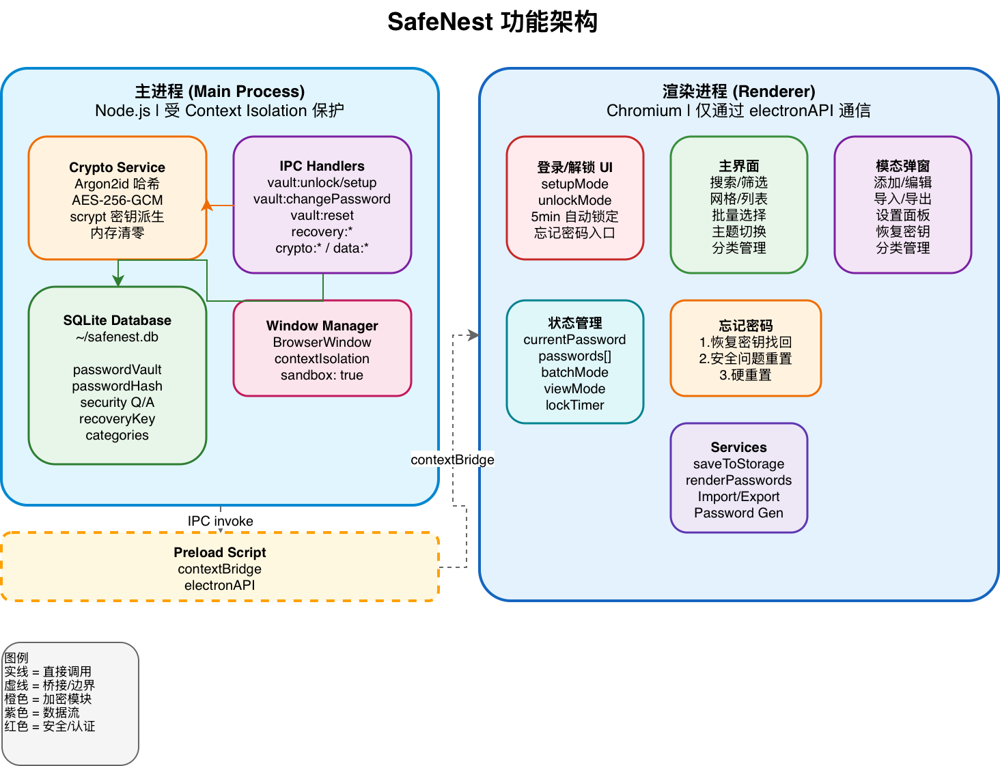
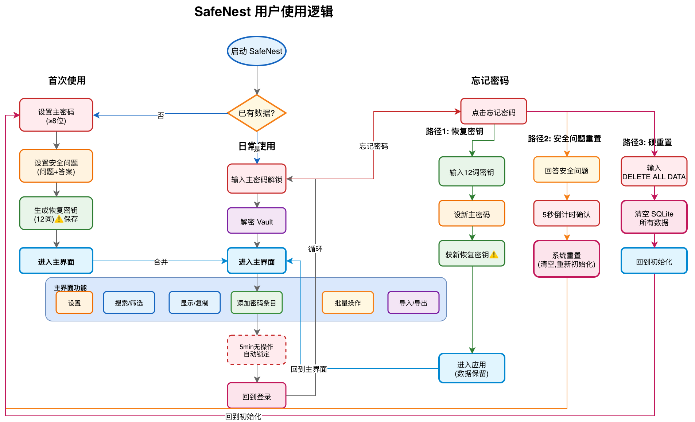

# SafeNest

A secure, local-first password manager built with **Electron + TypeScript + Vite**.

All your passwords are encrypted with **AES-256-GCM** and stored locally in an **SQLite** database. No cloud, no accounts, no data leaves your machine.

---

## Features

- **AES-256-GCM encryption** with Argon2id password hashing
- **Recovery key** system (12-word passphrase) for password recovery without data loss
- **Security question** based reset
- **Hard reset** to clear all local data for a fresh start
- **Password generator** (random + Diceware passphrase)
- **Batch select**, delete, export
- **Grid / list** dual view mode
- **Theme** system
- **Import / export** (Markdown, JSON, CSV)
- **5-minute auto-lock** timer

---

## Architecture

SafeNest follows Electron's security best practices: `contextIsolation: true`, `sandbox: true`, `nodeIntegration: false`. All cryptographic operations run in the **Main Process** (Node.js), protected from the renderer. The renderer only communicates via a type-safe `contextBridge` API.



---

## User Flow



---

## Tech Stack

| Layer | Technology |
|-------|-----------|
| Framework | Electron 41 |
| Build Tool | Vite + electron-vite |
| Language | TypeScript (strict) |
| Database | node:sqlite (DatabaseSync) |
| Crypto | Node.js crypto (AES-256-GCM, scrypt, randomBytes) |
| Password Hash | @node-rs/argon2 (Argon2id) |

---

## Security Design

- **Master password** is hashed with Argon2id (memoryCost: 65536, timeCost: 3, parallelism: 4)
- **Encryption key** is derived from password via scrypt
- **Vault data** is encrypted with AES-256-GCM (includes auth tag)
- **Memory clearing**: sensitive Buffer/Uint8Array data is explicitly zeroed after use (`buffer.fill(0)`)
- **Recovery key**: encrypts the master password (not the data directly), allowing password reset while preserving all entries
- **No network requests** for password checking — fully offline

---

## Development

```bash
# Install dependencies
npm install

# Dev mode
npm run dev

# Build
npm run build

# Type check
npx tsc --noEmit
```

---

## License

MIT
