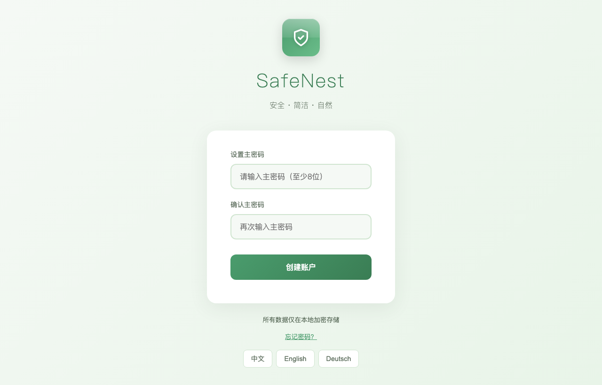
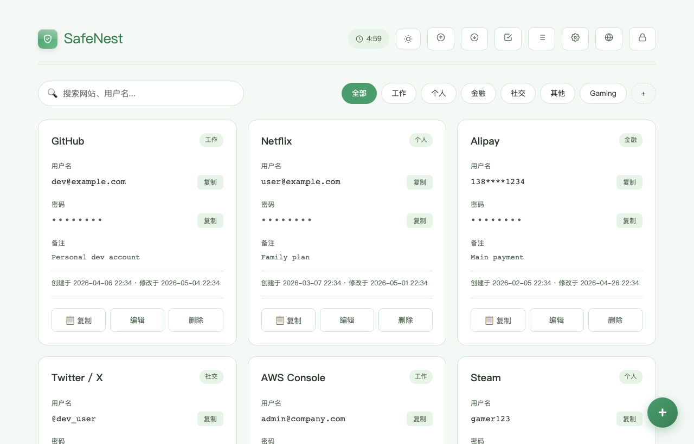
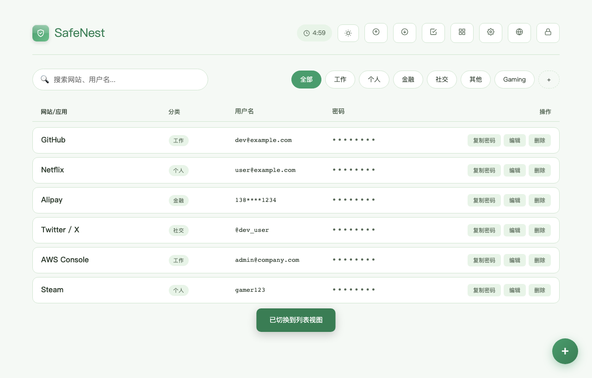
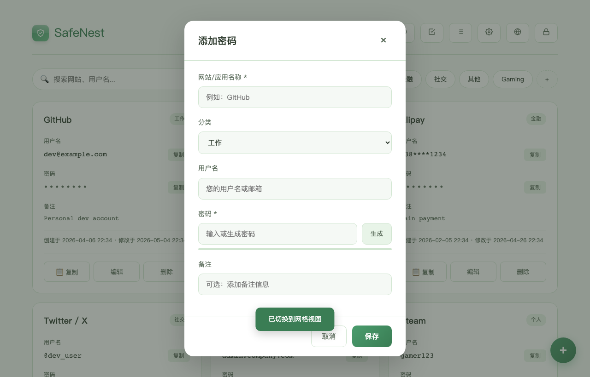
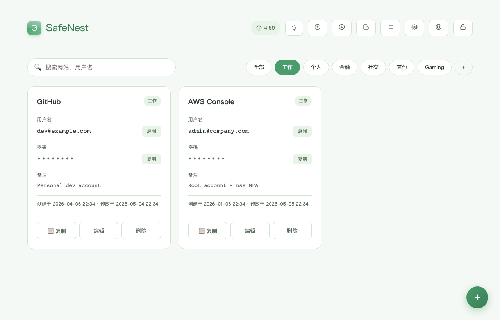
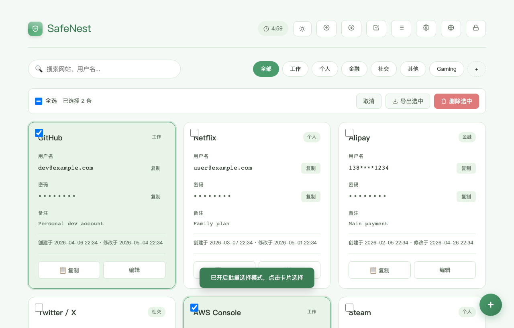
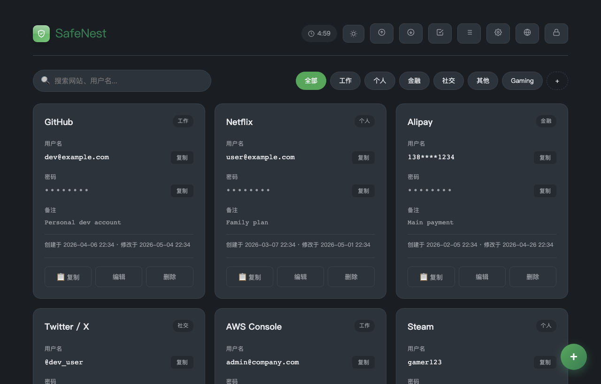
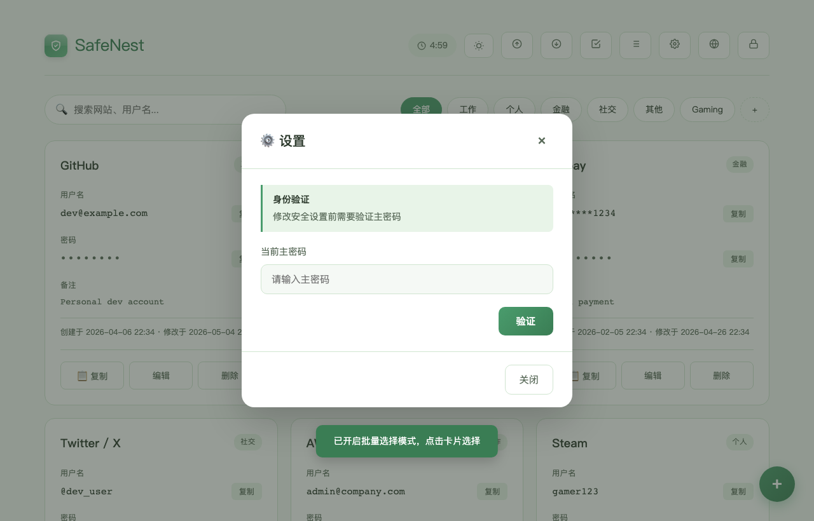
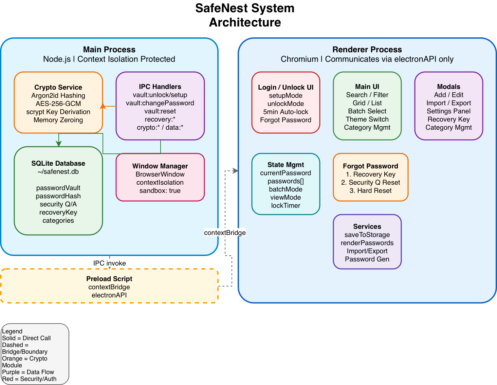
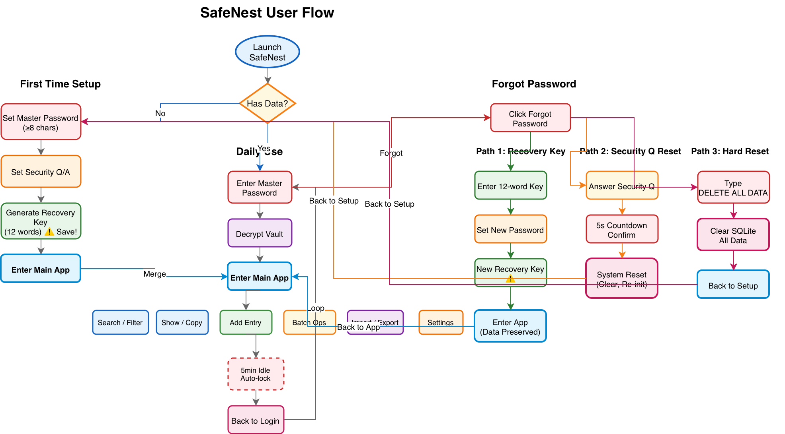

> [中文版](README.md) · [English Version](README_EN.md)

# SafeNest

Ein sicherer, lokal orientierter Passwort-Manager, gebaut mit **Electron + TypeScript + Vite**.

Alle Passwörter werden mit **AES-256-GCM** verschlüsselt und lokal in einer **SQLite**-Datenbank gespeichert. Keine Cloud, kein Account, keine Daten verlassen Ihr Gerät.

---

## Funktionen

- **AES-256-GCM-Verschlüsselung** mit Argon2id-Passwort-Hashing
- **Wiederherstellungsschlüssel**-System (12-Wort-Passphrase) zum Zurücksetzen des Passworts ohne Datenverlust
- **Sicherheitsfrage**-basiertes Zurücksetzen
- **Hard-Reset** zum vollständigen Löschen aller lokalen Daten
- **Passwort-Generator** (zufällig + Diceware-Passphrase)
- **Stapel-Auswahl**, Löschen, Exportieren
- **Raster / Liste** Dual-View-Modus
- **Theme**-System
- **Import / Export** (Markdown, JSON, CSV)
- **5-Minuten-Auto-Lock**-Timer
- **Virtuelles Scrolling**: Automatisch in der Listenansicht bei >50 Einträgen, verhindert DOM-Überlastung
- **Entprellte Suche**: 200ms Verzögerung vor der Filterung, reduziert redundante Renderings

## Screenshots

<p align="center">
  
  <br><em>Anmelden / Entsperren — unterstützt Ersteinrichtung und Master-Passwort-Entsperrung</em>
</p>

<p align="center">
  
  <br><em>Rasteransicht — Karten-Layout mit Kategorie-Tags auf einen Blick</em>
</p>

<p align="center">
  
  <br><em>Listenansicht — Kompaktes Layout mit virtuellem Scrolling (automatisch ab 50 Einträgen)</em>
</p>

<p align="center">
  
  <br><em>Eintrag hinzufügen / bearbeiten — integrierter Passwort-Generator mit Stärkeprüfung</em>
</p>

<p align="center">
  
  <br><em>Kategoriefilter — schnelle Filterung nach Arbeit, Persönlich, Finanzen usw.</em>
</p>

<p align="center">
  
  <br><em>Stapelmodus — Mehrfachauswahl für Massen-Export oder -Löschen</em>
</p>

<p align="center">
  
  <br><em>Dunkles Theme — 6 Themes zur Auswahl</em>
</p>

<p align="center">
  
  <br><em>Einstellungen — Master-Passwort ändern, Sicherheitsfrage, Wiederherstellungsschlüssel generieren</em>
</p>

---

## Architektur

SafeNest folgt den Electron-Sicherheits-Best-Practices: `contextIsolation: true`, `sandbox: true`, `nodeIntegration: false`. Alle kryptografischen Operationen laufen im **Hauptprozess** (Node.js), isoliert vom Renderer. Der Renderer kommuniziert ausschließlich über eine typsichere `contextBridge`-API.



---

## Benutzerablauf



---

## Technologie-Stack

| Ebene | Technologie |
|-------|------------|
| Framework | Electron 41 |
| Build-Tool | Vite + electron-vite |
| Sprache | TypeScript (Strict-Modus) |
| Datenbank | node:sqlite (DatabaseSync) |
| Krypto | Node.js crypto (AES-256-GCM, scrypt, randomBytes) |
| Passwort-Hash | @node-rs/argon2 (Argon2id) |

---

## Sicherheitsdesign

- **Master-Passwort** wird mit Argon2id gehasht (memoryCost: 65536, timeCost: 3, parallelism: 4)
- **Verschlüsselungsschlüssel** wird über scrypt aus dem Passwort abgeleitet
- **Tresor-Daten** werden mit AES-256-GCM verschlüsselt (inkl. Auth-Tag)
- **Speicherlöschung**: Sensitive Buffer/Uint8Array-Daten werden nach Gebrauch explizit mit Nullen überschrieben (`buffer.fill(0)`)
- **Wiederherstellungsschlüssel**: verschlüsselt das Master-Passwort (nicht die Daten direkt), ermöglicht Passwort-Reset unter Beibehaltung aller Einträge
- **Keine Netzwerk-Anfragen** für Passwortprüfung — vollständig offline

---

## Entwicklung

```bash
# Abhängigkeiten installieren
npm install

# Entwicklungsmodus
npm run dev

# Build
npm run build

# Typ-Prüfung
npx tsc --noEmit
```

---

## Lizenz

MIT

---
